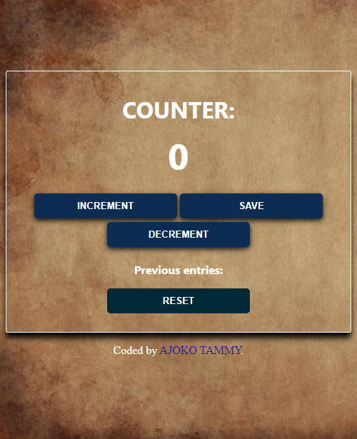

# Counter

## Table of contents

- [Overview](#overview)
  - [Screenshot](#screenshot)
  - [Links](#links)
  - [Built with](#built-with)
- [Author](#author)

## Overview
    DAY 5 OF 100 DAYS OF JAVASCRIPT
### Screenshot

### Links

- Live Site URL: [Live URL here](https://teal-starburst-a48a49.netlify.app/)

### Built with

- Semantic HTML5 markup
- CSS custom properties
- JavaScript

## Author

- Website - [AJOKO TAMMY](https://www.your-site.com)
- Frontend Mentor - [@Tammy-Ajoko](https://www.frontendmentor.io/profile/Tammy-Ajoko)
- Twitter - [@tammy_dickson_](https://www.twitter.com/tammy_dickson_)
    